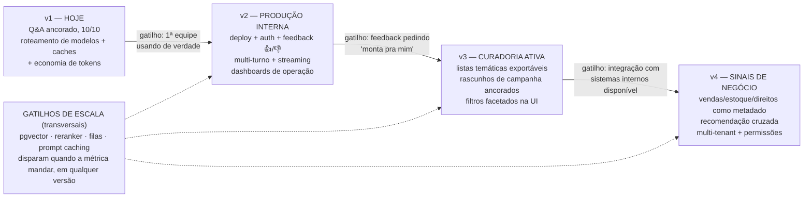

# 🗺️ Roadmap de evolução

Plano consolidado de upgrade do assistente — **evolução por gatilho medido, não por data**.
Cada upgrade tem um **sinal observável** que o justifica, e o sistema já coleta esses sinais
hoje (logs estruturados por requisição: latência por etapa, custo real, cache hit, mix de
tiers, taxa de abstenção; gate de CI com piso de recall@8).

> Versões alinhadas ao pitch ([`APRESENTACAO.md`](APRESENTACAO.md) §7):
> **v1** Q&A ancorado (hoje) → **v2** produção interna + feedback → **v3** ferramenta de
> curadoria (gerar conteúdo) → **v4** sinais de negócio. Gatilhos de escala são transversais.

---

## v1 — Estado atual (entregue)

- Pipeline completo: planner (LLM + fallback regex) → filtros duros → híbrido BM25+cosseno+RRF
  + Contextual Retrieval → ferramentas determinísticas → geração ancorada → verificação de citações.
- 10/10 nas perguntas-exemplo; avaliação em 3 camadas; gate de regressão no CI.
- Segurança OWASP LLM Top 10 (rate limit, teto de custo, anti-injeção estrutural, caches limitados).
- **Roteamento de modelos (OpenRouter)** com fallback automático e juiz de outra família;
  **roteamento inteligente por solicitação** (tier light/standard/heavy); **3 camadas de cache**
  + cache de embeddings; custo real por chamada ([`economia_de_tokens.md`](economia_de_tokens.md)).

**Pendências operacionais (antes da banca):** push do repositório + envio do link (48h antes,
PDF §7.5); rotacionar a `GEMINI_API_KEY` pré-demo (checklist da APRESENTACAO).

---

## v2 — Produção interna + loop de feedback

**Gatilho:** a primeira equipe (editorial/marketing/vendas) começa a usar de verdade.
**Tese:** antes de qualquer técnica nova, **fechar o loop com dados reais** — o gold-set de 10
perguntas vira um gold-set vivo, alimentado pelo uso.

| Item | Detalhe | O que já existe que habilita |
|---|---|---|
| Feedback 👍/👎 + comentário por resposta | **✅ COLETOR JÁ INSTALADO** (UI → `POST /feedback` → `data/feedback.jsonl`, com pergunta+resposta+plano+ids+custo por evento); resta o CONSUMIDOR: gold-set vivo + recalibração do juiz | método anti-circular já documentado em `eval/build_gold.py` |
| Deploy + autenticação | container + proxy reverso + SSO simples; secrets em vault | CI pronto; config 100% por env; chave já só no servidor |
| Multi-turno (bônus do PDF) | reescrita de pergunta com histórico (resolução de anáfora) ANTES do planner; cache chaveado pela pergunta **reescrita** | planner já estrutura intenção; caches já têm gate de segurança |
| Streaming (SSE) | corta latência percebida de ~7s para ~1s até o 1º token | FastAPI suporta; UI Streamlit consome SSE |
| Dashboards de operação | p95 por etapa, custo/dia, cache hit rate, mix de tiers, taxa de abstenção, modelos que atenderam (roteamento) | logs JSON estruturados já emitem tudo isso por requisição |
| Persistir cache de chamadas | `LLM_CACHE_PERSIST=true` (+ avaliar prompt caching nativo do provedor) | `LLMCache` já implementado com disco opcional |

**Métricas de sucesso (PO):** perguntas/semana por equipe; taxa de aceitação > 80%;
p95 < 8s (< 1s percebido com streaming); custo/resposta < US$ 0,002; 0 alucinações reportadas.

---

## Gatilhos de escala (transversais — disparam quando a métrica mandar)

| Upgrade | Gatilho observável | O que muda (e o que NÃO muda) |
|---|---|---|
| **pgvector / índice ANN** | corpus > ~50–100k livros OU retrieval p95 > 100 ms | só a camada de armazenamento do retriever; planner/RRF/geração intactos |
| **Reranker** (LLM-rerank via OpenRouter ou cross-encoder) | MRR < ~0,9 ou recall@8 abaixo do piso do gate com corpus crescido | flag `RERANK_ENABLED` reordenando top-20 → top-8; hoje as métricas estão no teto (MRR 1,0) — sem ganho possível |
| **Fila/processamento assíncrono** | > ~10k req/dia ou geração travando workers | `/ask` enfileira; UI consome por SSE |
| **Re-embedding / modelo melhor** | nDCG@8 caindo no gate após mudanças de catálogo | trocar `GEMINI_EMBEDDING_MODEL` e re-rodar `build_index.py` (cache invalida sozinho pelo hash) |
| **Limpeza na ingestão** | conflitos título×sinopse (como Q4/Q5) em dado real | validação na entrada vira regra de pipeline de dados; a regra de prompt que expõe contradições continua como rede de segurança |

---

## v3 — De Q&A para ferramenta de curadoria ativa

**Gatilho:** feedback do v2 pedindo "monta pra mim" (listas, textos), não só "me responde".

- **Listas temáticas exportáveis** (CSV/Notion): as ferramentas de grupo/diversidade já produzem
  a seleção; falta UX de exportação e edição.
- **Rascunhos de campanha ancorados**: gerar texto de marketing citando apenas livros reais do
  catálogo (a verificação de citações vira o guardrail de marketing).
- **Filtros combináveis (facetas) na UI**: gênero × público × ano clicáveis, combinados com a
  pergunta livre (o `RetrievalPlan` já aceita exatamente esses campos).

**Métrica:** % de listas/rascunhos gerados que viram campanha/ação real.

---

## v4 — Sinais de negócio e multi-tenant

**Gatilho:** integração disponível com sistemas internos (vendas/estoque/direitos).

- Vendas, estoque e direitos como **metadado filtrável** ("o que está em alta E temos estoque?").
- Recomendação cruzada ("parecidos com X que venderam bem").
- **Multi-tenant** (catálogos por selo/editora) + permissionamento por equipe.
- LGPD reforçada: `LOG_QUESTIONS=false` em produção, retenção definida, PII redaction nos logs.

---

## O que continua FORA (e por quê — tão importante quanto o que entra)

- **Fine-tuning**: prompt + ferramentas determinísticas resolvem; custo de manutenção alto e
  perde-se a troca fácil de modelo (que o roteamento dá de graça).
- **GraphRAG**: sem corpus multi-hop/entidades densas; gatilho seria texto integral das obras.
- **Framework de agente no fluxo principal**: o pipeline é determinístico de propósito —
  auditabilidade e custo previsível valem mais que autonomia aqui.

> Frase para a banca: *"o roadmap não é uma lista de desejos — cada passo tem um gatilho medido
> pelo próprio sistema, e o que ficou de fora tem o porquê e o sinal que o traria de volta."*
