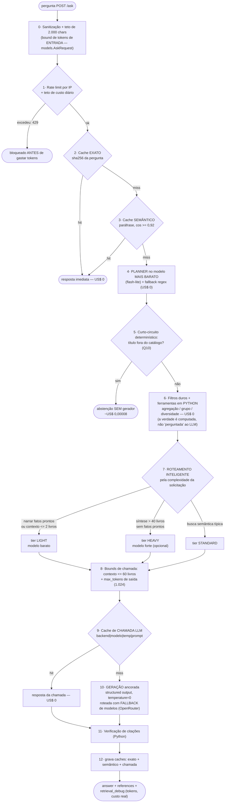
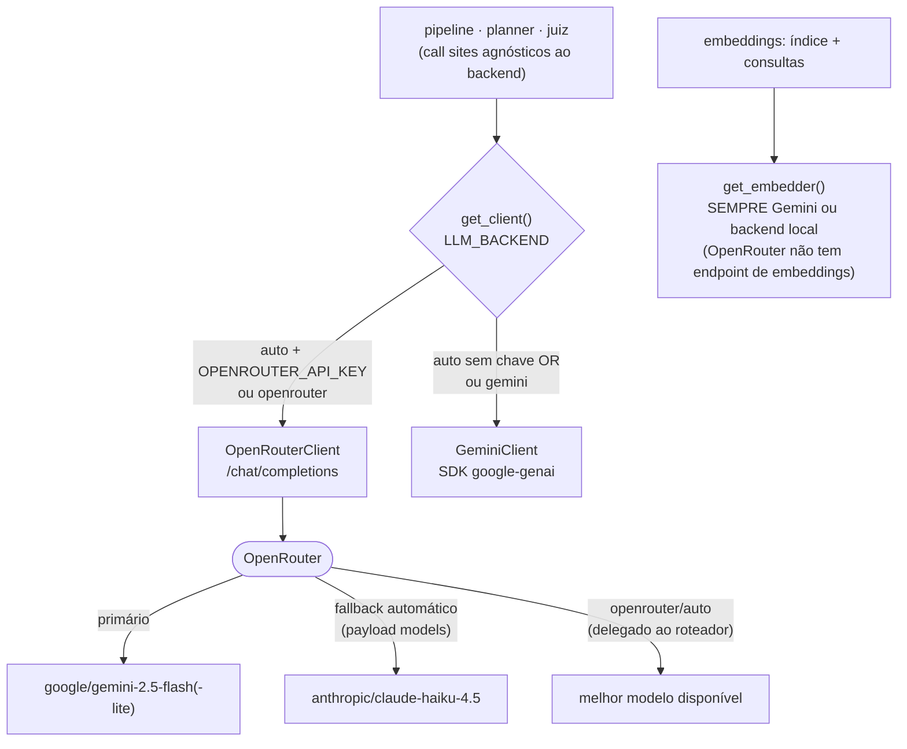
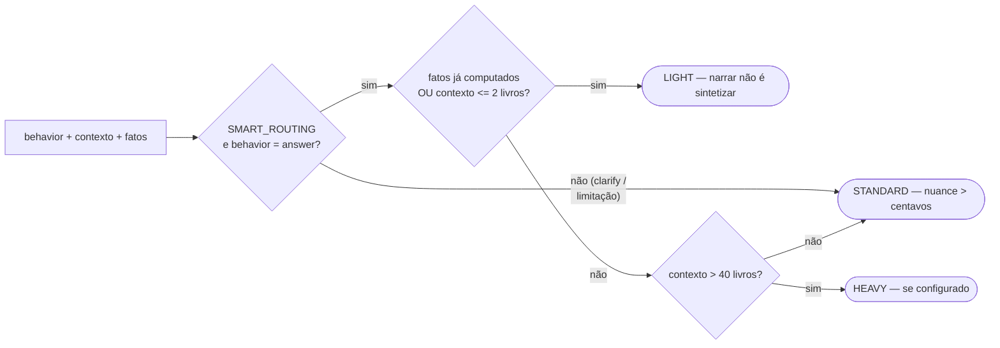

# 💰 Fluxo de economia de tokens

Este documento descreve **todas as camadas de economia de tokens/custo** do assistente, na
**ordem exata** em que atuam numa requisição `POST /ask`, e como o **roteamento de modelos
(OpenRouter)** e o **roteamento inteligente por solicitação** se encaixam nelas.

Princípio geral: **o token mais barato é o que não é gasto.** Por isso a ordem importa —
cada camada tenta resolver a requisição *antes* da próxima (mais cara) entrar em ação, e o
LLM só é chamado com o **menor modelo que dá conta** e o **menor contexto que basta**.

---

## 1. Fluxograma da requisição (`POST /ask`)

> Cada resposta carrega `retrieval_debug.tokens` (por chamada, com flag `cached`) e
> `estimated_cost_usd` — o custo **marginal real** da requisição é observável, sempre.

---

## 2. Roteamento de modelos (OpenRouter)

Com `OPENROUTER_API_KEY` no `.env` (e `LLM_BACKEND=auto`), o lado de **chat** (planner,
geração, juiz) passa a ser servido pelo [OpenRouter](https://openrouter.ai) — uma camada de
roteamento sobre a API OpenAI-compatível:

O que o roteamento dá (e o que custa):

| Capacidade | Como | Por quê |
|---|---|---|
| Trocar modelo/provedor **sem deploy** | slugs em `.env` (`OPENROUTER_MODEL=...`) | rate-limit/deprecação no meio da demo deixa de ser incidente |
| **Fallback automático** entre modelos | `OPENROUTER_FALLBACK_MODELS` → payload `models:[...]` | o roteador tenta o próximo se o primário falhar — resiliência sem retry manual |
| Roteamento de **provedor** por preço/vazão/latência | `OPENROUTER_SORT=price\|throughput\|latency` | espreme custo/latência p/ o mesmo modelo |
| **Juiz de outra família** | `OPENROUTER_JUDGE_MODEL=anthropic/claude-haiku-4.5` | mitiga o viés "Gemini avaliando Gemini" apontado no README §7 |
| **Custo real** por chamada | `usage: {include: true}` → `usage.cost` da resposta | o `retrieval_debug` mostra o custo cobrado, não estimado |
| Schema garantido | `response_format: json_schema (strict)` + `provider.require_parameters` | só roteia p/ provedores que honram o schema; se um modelo rejeitar, repete sem schema (os prompts já exigem JSON e o parser limpa cercas) |

**Embeddings nunca passam pelo OpenRouter** (não existe endpoint lá): ficam no
`gemini-embedding-001` (cache em disco commitado → revisor roda offline) ou no backend
local (`EMBEDDINGS_BACKEND=local`). É por isso que existem **dois singletons**:
`get_client()` (chat, roteável) e `get_embedder()` (sempre Gemini/local).

---

## 3. Roteamento inteligente por solicitação

A decisão é **determinística, em Python, testável** (`app/pipeline.py::route_generation_model`)
— nunca "perguntamos ao LLM qual LLM usar":

Racional de cada tier:

- **LIGHT** (`*_MODEL_LIGHT`, padrão flash-lite): quando a resposta é **reformatação** de uma
  verdade que **já foi computada** pelas ferramentas determinísticas (Q8 mín/máx, Q6 grupos)
  ou o contexto é minúsculo (título encontrado, ≤ 2 livros). O modelo barato não tem onde
  errar: os fatos entram prontos no prompt e a **verificação de citações** continua atrás.
- **STANDARD** (`OPENROUTER_MODEL` / `GEMINI_MODEL`): busca semântica típica (Q1/Q3/Q5/Q7) —
  qualidade onde ela de fato importa.
- **HEAVY** (`*_MODEL_HEAVY`, vazio por padrão = usa o standard): válvula para sínteses
  muito longas (> 40 livros) sem fatos prontos.
- `clarify` / `acknowledge_limitation` **nunca caem no light**: são os comportamentos que
  exigem nuance (Q9/Q2), e centavos não pagam uma resposta ruim.

O tier escolhido é **observável** em `retrieval_debug.notes`
(`roteamento: tier=light -> google/gemini-2.5-flash-lite`).

---

## 4. As três camadas de cache (e por que três)

| Camada | Chave | Pega o quê | Onde |
|---|---|---|---|
| **Resposta exata** | sha256 da pergunta | repetição literal (demo, retry de UI) | `pipeline._cache` |
| **Resposta semântica** | embedding da pergunta, cos ≥ 0,92 | paráfrases ("o que temos de IA?" ≈ "quais livros sobre IA?") — exceto perguntas com número/negação/comparação (SEC-03) | `pipeline._sem_cache` |
| **Chamada LLM** *(novo)* | `backend\|modelo\|temperatura\|tipo\|system\|user` | repetições que as camadas acima não veem: re-rodar `eval/judge`, regerar cartões, a mesma sub-chamada vinda de fluxos diferentes | `llm._llm_cache` |

Por que a 3ª camada é segura: `temperature=0` torna a chamada **determinística** — mesma
entrada, mesma saída. Hit devolve `Usage(cached=True, custo=0)`: o `retrieval_debug` mostra
o custo **marginal** verdadeiro.

Propriedades de segurança (mesmo padrão da auditoria SEC): memória **limitada** com evicção
FIFO (`LLM_CACHE_MAX_ENTRIES`, anti-DoS), mutação **sob lock** (o `/ask` roda no threadpool)
e persistência em disco **opcional e desligada por padrão** (`LLM_CACHE_PERSIST`) — 1 arquivo
por entrada em `data/llm_cache/` (gitignored), sem risco de corrupção concorrente. Ligue a
persistência para re-rodar a avaliação inteira a custo ~zero entre processos.

---

## 5. Mapa de medidas → onde vivem no código

| # | Medida | Arquivo | Knob (`.env`) |
|---|---|---|---|
| 0 | Teto de 2.000 chars + sanitização da entrada | `app/models.py` (AskRequest) | — |
| 1 | Rate limit por IP + teto de custo diário | `app/api.py` | `RATE_LIMIT_RPM`, `DAILY_COST_CAP_USD` |
| 2–3 | Caches de resposta (exato + semântico) | `app/pipeline.py` | `SEMANTIC_CACHE_*`, `MAX_CACHE_ENTRIES` |
| 4 | Planner no modelo mais barato + fallback regex | `app/planner.py` | `*_PLANNER_MODEL` |
| 5 | Abstenção por curto-circuito (sem gerador) | `app/pipeline.py` (`_handle_title_lookup`) | `TITLE_MATCH_THRESHOLD` |
| 6 | Verdade computada em Python (agregação/grupo/diversidade) | `app/tools.py` | — |
| 7 | Roteamento inteligente por solicitação | `app/pipeline.py` (`route_generation_model`) | `SMART_ROUTING`, `*_MODEL_LIGHT/HEAVY` |
| 8 | Cap de contexto (≤ 60 livros) + teto de saída | `app/prompts.py`, `app/llm.py` | `LLM_MAX_OUTPUT_TOKENS` |
| 9 | Cache de chamadas LLM | `app/llm.py` (`LLMCache`) | `LLM_CACHE_*` |
| 10 | Roteamento de modelos + custo real + fallback | `app/llm.py` (`OpenRouterClient`) | `LLM_BACKEND`, `OPENROUTER_*` |
| — | Embeddings cacheados em disco (commitados) | `app/embeddings.py` | `EMBEDDINGS_BACKEND` |
| — | `temperature=0` (determinismo → caches rendem) | `app/llm.py` | `LLM_TEMPERATURE` |

---

## 6. Quanto isso economiza (números)

Base medida (RESULTS.md §4, Gemini direto, sem roteamento inteligente):
**~US$ 0,0016/requisição** na média das 10 perguntas.

| Situação | Antes | Com o fluxo completo |
|---|---|---|
| Pergunta repetida (cache exato/semântico) | ~US$ 0,0016 | **US$ 0** |
| Q10 — livro fora do catálogo | US$ 0,00008 (já era curto-circuito) | US$ 0,00008 |
| Q8 — mais antigo/recente (fatos prontos → **light**) | ~US$ 0,0020 | **~US$ 0,0006** (≈ −70%) |
| Q6 — 26 livros por categoria (fatos prontos → **light**) | ~US$ 0,0039 | **~US$ 0,0010** (≈ −74%) |
| Re-rodar `eval/judge.py` (cache de chamadas + persistência) | ~US$ 0,016 | **~US$ 0** |
| Pico de saída anômalo | ilimitado | ≤ `LLM_MAX_OUTPUT_TOKENS` (1.024) |

> Estimativas do tier light usam a tabela flash-lite (US$ 0,10/0,40 por Mtok) sobre os
> volumes de tokens medidos; com OpenRouter o valor exato vem em `usage.cost` por chamada.
> Reverter tudo: `SMART_ROUTING=false`, `LLM_CACHE_ENABLED=false`, `LLM_BACKEND=gemini`.

---

## 7. O que foi *deliberadamente* deixado de fora

- **Prompt caching nativo de provedor** (Anthropic/Gemini *implicit caching*): com prompts de
  ~3k tokens e tráfego de demo, o ganho não paga a complexidade agora; vira prioridade com
  tráfego real e system prompts longos.
- **Truncar sinopses no contexto**: economizaria pouco (sinopses já são curtas) e arriscaria
  o grounding — a verificação de citações depende do gerador ver o dado completo.
- **Quantização/redução de dimensão dos embeddings**: 768d × 200 docs já é desprezível.
